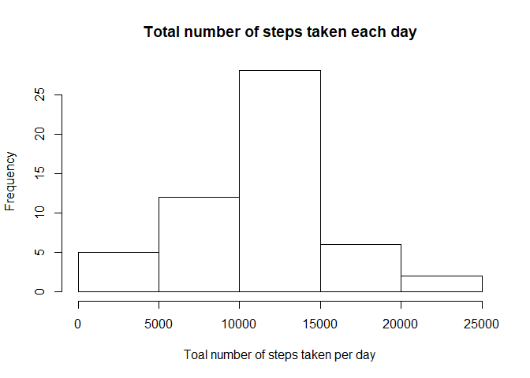
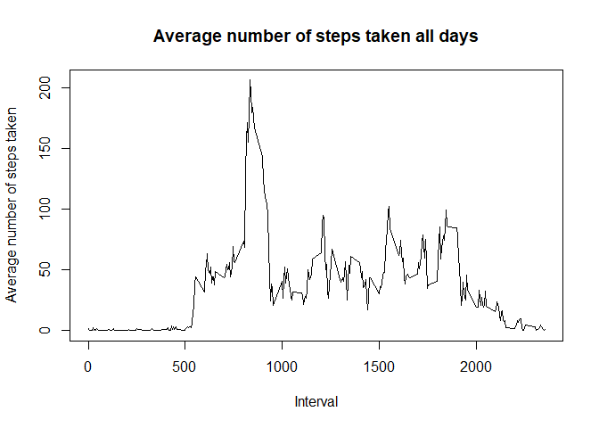
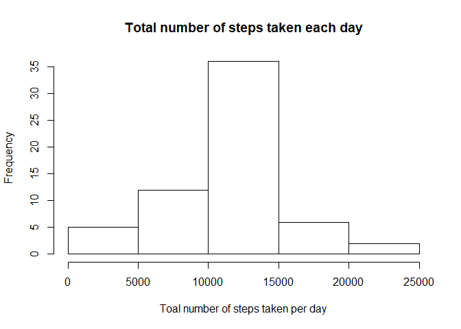
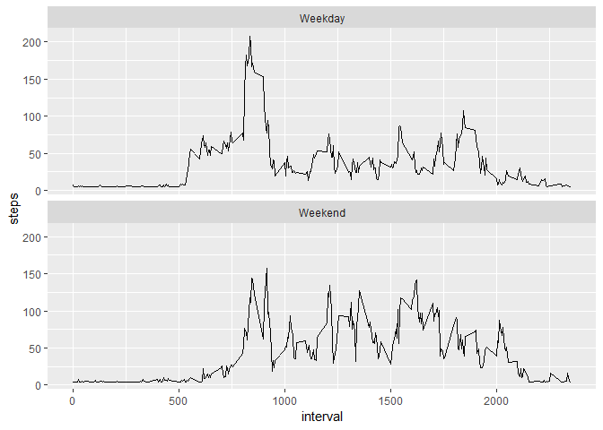

This assignment makes use of data from a personal activity monitoring device. This device collects data at 5 minute intervals through out the day. The data consists of two months of data from an anonymous individual collected during the months of October and November, 2012 and include the number of steps taken in 5 minute intervals each day.

The variables included in this dataset are:

- **steps:** Number of steps taking in a 5-minute interval (missing values are coded as \color{red}{\verb|NA|}NA)
- **date:** The date on which the measurement was taken in YYYY-MM-DD format
- **interval:** Identifier for the 5-minute interval in which measurement was taken  
The dataset is stored in a comma-separated-value (CSV) file and there are a total of 17,568 observations in this dataset.


```r
# load all packages used in this exploratory analysis
library(knitr)
library(dplyr)
```

```
## 
## Attaching package: 'dplyr'
```

```
## The following objects are masked from 'package:stats':
## 
##     filter, lag
```

```
## The following objects are masked from 'package:base':
## 
##     intersect, setdiff, setequal, union
```

```r
library(ggplot2)
library(Hmisc)
```

```
## Loading required package: lattice
```

```
## Loading required package: survival
```

```
## Loading required package: Formula
```

```
## 
## Attaching package: 'Hmisc'
```

```
## The following objects are masked from 'package:dplyr':
## 
##     src, summarize
```

```
## The following objects are masked from 'package:base':
## 
##     format.pval, units
```

```r
opts_chunk$set(echo = TRUE)
```

## Loading and preprocessing the data


```r
unzip(zipfile = "activity.zip")
data_row <- read.csv("activity.csv")
```


## What is mean total number of steps taken per day?

Calculate the total number of steps taken per day

```r
data <- data_row[ !is.na(data_row$steps),]

by_day <- group_by(data, date)

total_steps <- summarise(by_day, total = sum(steps))

head(total_steps,nrow(total_steps))
```

```
## # A tibble: 53 x 2
##    date       total
##    <fct>      <int>
##  1 2012-10-02   126
##  2 2012-10-03 11352
##  3 2012-10-04 12116
##  4 2012-10-05 13294
##  5 2012-10-06 15420
##  6 2012-10-07 11015
##  7 2012-10-09 12811
##  8 2012-10-10  9900
##  9 2012-10-11 10304
## 10 2012-10-12 17382
## # ... with 43 more rows
```

Histogram of the total number of steps taken each day


```r
hist(total_steps$total, main = "Total number of steps taken each day", xlab = "Toal number of steps taken per day")
```

<!-- -->

Mean and median of the total number of steps taken per day

```r
summary(total_steps)
```

```
##          date        total      
##  2012-10-02: 1   Min.   :   41  
##  2012-10-03: 1   1st Qu.: 8841  
##  2012-10-04: 1   Median :10765  
##  2012-10-05: 1   Mean   :10766  
##  2012-10-06: 1   3rd Qu.:13294  
##  2012-10-07: 1   Max.   :21194  
##  (Other)   :47
```


## What is the average daily activity pattern?

A time series plot of the 5-minute interval and the average number of steps taken, averaged across all days


```r
avg <- aggregate(steps ~ interval, by_day, mean)

plot(avg$interval, avg$steps, type="l", main = "Average number of steps taken all days", xlab = "Interval", ylab = "Average number of steps taken")
```

<!-- -->

Which 5-minute interval, on average across all the days in the dataset, contains the maximum number of steps?


```r
filter(avg, steps==max(steps))
```

```
##   interval    steps
## 1      835 206.1698
```

## Imputing missing values
Calculate and report the total number of missing values in the dataset.


```r
 sum(is.na(data_row))
```

```
## [1] 2304
```

Strategy for filling in all of the missing values in the dataset
Create a new dataset that is equal to the original dataset but with the missing data filled in.

```r
dataImpute <- data_row
dataImpute$steps <- impute(data_row$steps, fun = mean)
```

Histogram of the total number of steps taken each day


```r
totalSteps <- tapply(dataImpute$steps, dataImpute$date, sum)

hist(totalSteps, main = "Total number of steps taken each day", xlab = "Toal number of steps taken per day")
```

<!-- -->

Calculate and report the mean and median total number of steps taken per day


```r
mean(totalSteps)
```

```
## [1] 10766.19
```


```r
median(totalSteps)
```

```
## [1] 10766.19
```

What is the impact of imputing missing data on the estimates of the total daily number of steps?

Mean and median values are higher after imputing missing data. The reason is that in the original data, there are some days with steps values NA for any interval. The total number of steps taken in such days are set to 0s by default. However, after replacing missing steps values with the mean steps of associated interval value, these 0 values are removed from the histogram of total number of steps taken each day.


## Are there differences in activity patterns between weekdays and weekends?

Create a new factor variable in the dataset with two levels - "weekday" and "weekend" indicating whether a given date is a weekday or weekend day.


```r
dataImpute$days_type <- weekdays(as.Date(dataImpute$date))

dataImpute$days_type[dataImpute$days_type %in% c('Sunday','Saturday')] <- "Weekend"

dataImpute$days_type[dataImpute$days_type != "Weekend"] <- "Weekday"
```

Make a panel plot containing a time series plot of the 5-minute interval (x-axis) and the average number of steps taken, averaged across all weekday days or weekend days (y-axis).


```r
aggrData <- aggregate(steps ~ interval + days_type, dataImpute, mean)

qplot(interval, steps, data = aggrData, geom = c("line")) + facet_wrap(days_type~.,ncol=1)
```

<!-- -->
